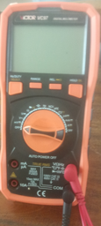
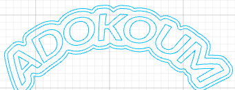
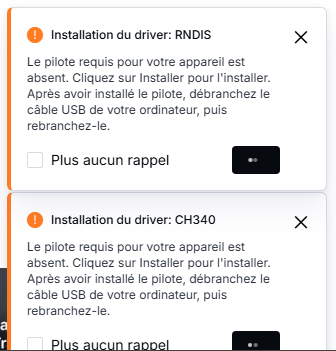

# Journal du 26 août 2026 (rédigé par Méyébinesso ADOKOUM)
## Fait aujourd'hui
- Repartition en quatre équipes de 25 personnes
- Contrôle de présence
- Distribution des PC
- Mise en place dans les différents atéliers

>Prémier atélierer: ELECTRONIQUE

- Définitions et découverte des composants éléctroniques
- Reconaissance des symboles des différents composants électroniques
- Mesure des grandeurs avec les résistances, les piles et les LEDs
- Calcule des valeurs de résistance en fonction des codes couleurs 

- Pause de 15 min

> Deuxième atélier: FABRICATION NUMERIQUE - IMPRESSION 3D

- Objectifs pédagogiques: Comprendre - Maitriser - Produire - Diagnostiquer
- Présentation des imprimantes 3D et estimation de leurs coût d'achat
- Historique des imprimante 3D
- Composants d'une imprimante 3D
- Les différentes technologies
- Les différents types de Filaments de base
- Critères à connaitre pour bien paramétrer ume iprimante
- Liste des logiciels à utiliser du fichier numérique à l'objet physique
- Les trois logiques de fabrication

- Pause d'une heure

> Troisième atélier: PROJET INTEGRATEUR

- Propositions des projets 
- Expliccation du projet éducatif final à déployer en utilisant un micro-contrôleur combinées avec les péripheriques d'entrés et sorties 

> Quatrième atélier: DECOUPE LAZER

- Présentatation des équipements
- Comparatif des lazers
- Fonctionnement d'une découpe lazer
- Anatomie d'une découpe lazer
- Les grandes familles de lazer industriels
- Précision et qualité de découpe
- Les classes de sécurité lazer
- Comment choisir son lazer et  les supports à utiliser
- Les points clés à retenir
- Installation du logiciel xTool
- Installation des pilotes de xTool
- Modélisation de mon nom et parametrage sur le logiciel xTool

- Connexion à la découpe lazer P3 
- Lancement du processus de découpe de mon nom

## Appris
- Lecture et calibrage du multimètre
- Mesure des grandeurs (Tension et Résistance) au multimètre
- Les types d'imprimantes 3D 
- Les différents filaments utilisées avec les imprimantes
- Paramétrage d'une imprimante
- Les fonctions d'une imprimantes 3D
- Les différentes découpes lazers
- Le logiciel xTool et son utilisation
- Réealisation d'une découpe

## Raté, puis corrigé
- [Prémière tentative de découpe raté] ----> [ Manque des pilotes RNDIS et CH340. L'installation était raté parcequ'il y avait un problèmes avec la connexion internet ] ----> [ Réinstallation des pilotes] ----> [Succès]

