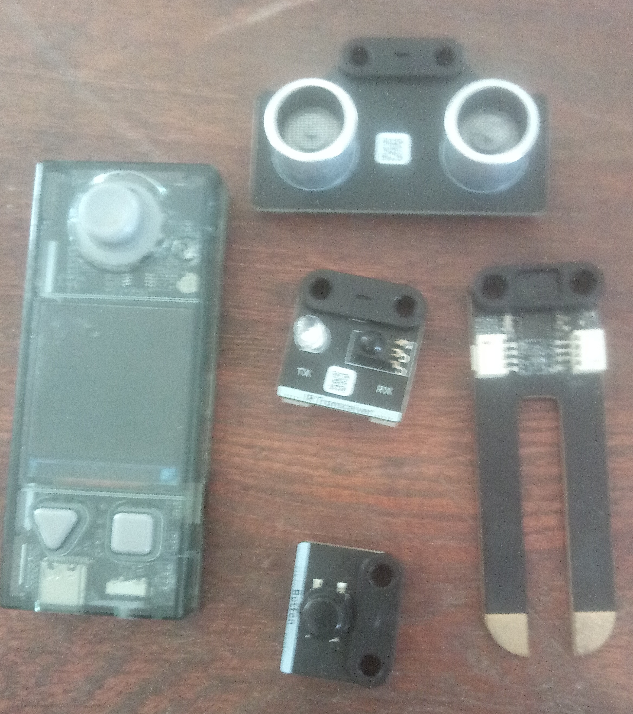
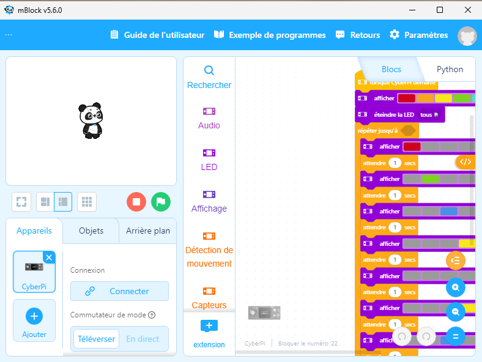
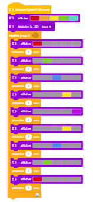
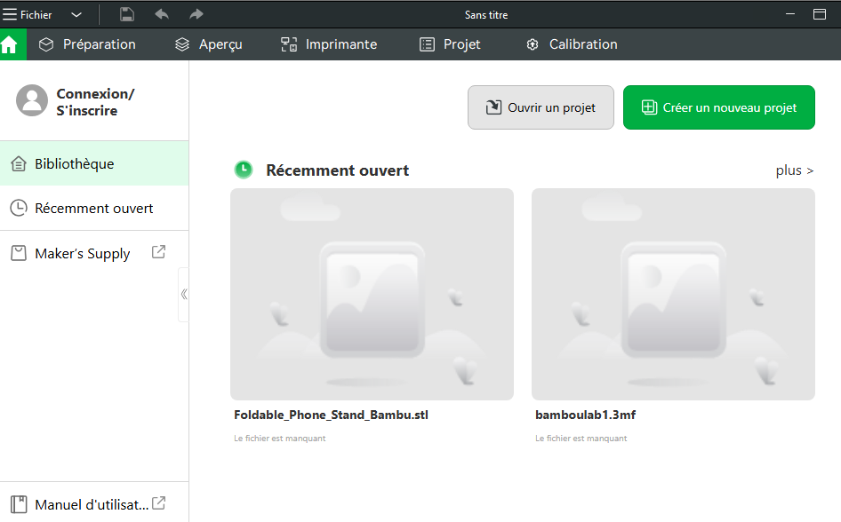
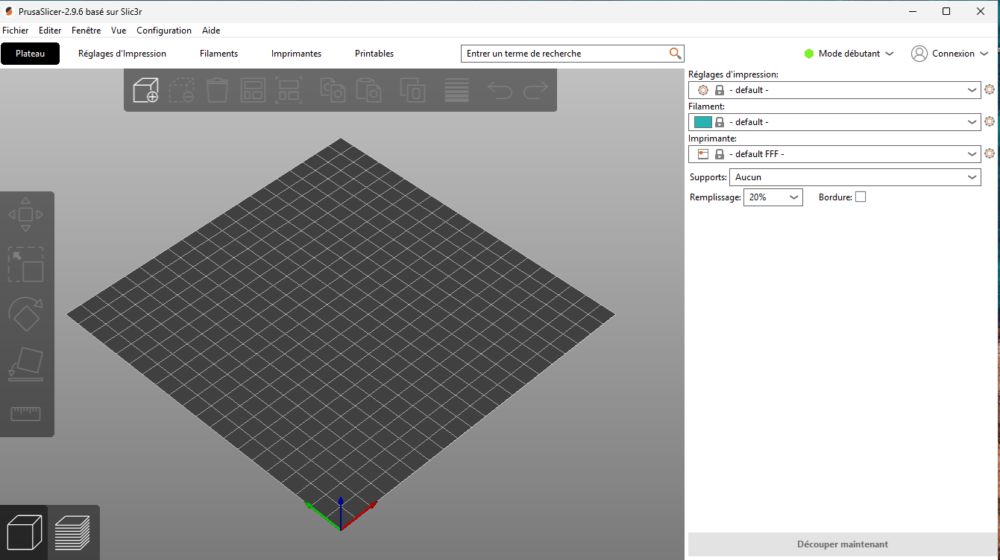

# Journal du 27 août 2026 (rédigé par Méyébinesso ADOKOUM)
## Fait aujourd'hui

- Contrôle de 
- Distribution des PC
- Mise en place dans les différents atéliers

>Prémier atélierer: DECOUPE LAZER

- Réalisation et écoupe d'une carte de visite (100 mm x 50 mm) sur la déoupe lazer P3

- Pause de 15 minutes

> Deuxième atélier: ELECTRONIQUE

- Rappels sur les bases de l'élèctronique
- Les objectifs pédagogiques
- Notions de capteurs et actionneurs
- Images du microcontroleur **CyberPi** et quelques capteurs

- La CberPi et l'écosystème **mBuild**

- Installation du logiciel **mBloc**

- Le logiciel mBloc peut être utiliser directement en ligne sur [ide.mblock.cc](ide.mblock.cc) 
- Prise en main de l'environement de mBlock
- Réalisation de mon prémier TP sur mBloc pour faire clignoter les LEDs une par une, de droite à gauche et ensuite de gauche à droit jusqu'à l'infini.

- Pause d'une heure

> Troisième atélier: FABRICATION NUMERIQUE - IMPRESSION 3D

- Installation de Bambu Studio

- Installation de Prusa Slicer

- Pause de 15 minutes

> Quatrième atélier: PROJETS
- Discution en groupe

# Appris

- Decouverte des logiciels mBloc, Bambu Studio et Prusa Slicer
## Décidé
- Rien
## À faire demain
- [Exercices  sur mBloc et BambuLab] — Méyébinesso ADOKOUM
