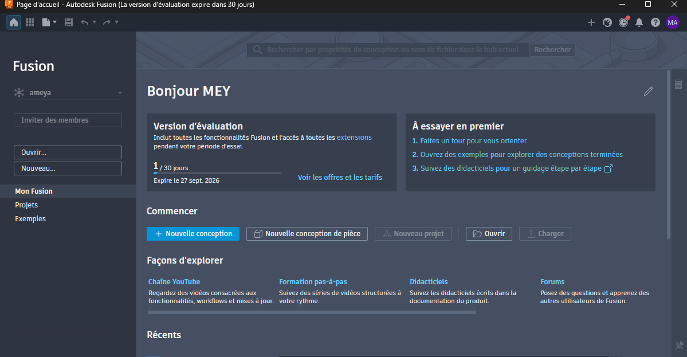
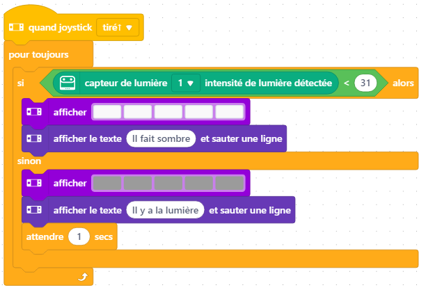

# Journal du 27 août 2026 (rédigé par Méyébinesso ADOKOUM)
## Fait aujourd'hui

- Contrôle de 
- Distribution des PC
- Mise en place dans les différents atéliers

>Prémier atélierer:PROJETS

- Réflexion sur les projets
- Rédaction du journal
- Soutient aux camarades pour configuration et likage de leur  compte GitHub à VSCode
- Soutient aux camarades pour dépanage et installation de Fusion AutoDesk
- Soutient aux camarades afin de maitiser la syntaxe utliser par le langage Markdown  puor ajouter des images. Plus precisement comment identifier le chemin vers un fichier image.  
- Installation de Autodesk Fusion 360

> Deuxième atélier: ELECTRONIQUE

- Réalisation du TP avec cyberPi et un capteur de luminosité. Récupérer les différents niveau de luminosité puis allumer les LEDs et afficher "il y a lumière" en presence de lumière  ou eteindre  les LEDs et afficher "il fait sombre" en abscence de lumière.
- Le programme sur mBloc est le suivant :

> Troisième atélier: IMPRESSION 3D

- Importation du fichier contenant le modèle à imprimer
- Slicer l'objet avec BambuLab
- Réglage des paramètres avant impression dans le logiciel BambuLab: Choix de l'imprimante (H2S ou P3S ) , du filament et activation des supports.
- Activer et placer les supports aux endroits réquis pour soutenir l'objet à imprimer.
- Exportez sur support USB et branchement sur l'imprimante
- Réglages des paramètres ave l'ecran de l'imprimante.

> Quatrième atélier: DECOUPE LAZER

- Découpe de la carte de visite
- Pause d'une heure

> Atélier cinq: Explication du Cahier de charges

## Appris
- 

## Décidé
- Rien
## À faire demain

- [TP & Révision] — Méyébinesso ADOKOUM