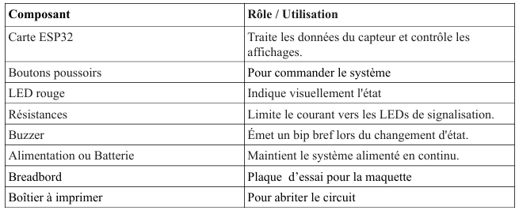

# Journal du 31 août 2026 (rédigé par Méyébinesso ADOKOUM)
## Fait aujourd'hui

- Contrôle de présence
- Distribution des PC
- Recherche de nouveau projet
- Validations des projets
> Réalistion de la fiche projet

PROJET :  MINUTEUR GÉANT POUR LES ACTIVITÉS PÉDAGOGIQUES AVEC 
SIRÈNE  

1.  Informations générales
Minuteur géant pour activités : Un petit écran ou une rangée de LED qui décompte le temps 
restant pour un exercice (5 ou 10 minutes) avec une alarme sonore à la fin. 
Intitulé du projet : Minuteur géant pour activités pédagogiques
Domaine : Électronique – Informatique - Automatisme
Cadre de réalisation : FabLab éducatif
Durée : trois semaines
Lieu : Lomé
Établissement : INFPP
Responsable :
Année : 2026
Équipe de réalisation : Groupe 14

2.  Descriptif détaillé du projet 
Ce projet consiste à fabriquer un minuteur géant à affichage numérique haute visibilité, piloté 
par un microcontrôleur ESP32 et éclairé par un ruban LED adressable WS2812B (Neopixel). 
Conçu pour répondre aux besoins d'organisation dans de grands espaces (salles d'examen, 
gymnases, amphithéâtres, ateliers d'innovation ou événements sportifs), il remplace les chronomètres classiques peu lisibles par une solution visuelle dynamique et entièrement 
personnalisable.

### Problèmes identifiés
Les apprenants ont parfois des difficultés à visualiser le temps restant pendant une activité 
pédagogique.
Cela peut entraîner :
-  une mauvaise gestion du temps ;
-  le dépassement du temps prévu ;
-  des rappels fréquents de l'enseignant ;
-  une organisation moins efficace des activités

3. Objectifs
### Objectif général : 
Concevoir et réaliser un minuteur géant pédagogique électronique permettant d'afficher clairement 
le temps restant lors des activités scolaires.
### Objectifs spécifiques
- Permettre le réglage d'une durée.
-  Afficher le temps sous forme heures - minutes - secondes.
- Permettre le démarrage du compte à rebours.
- Permettre la mise en pause 
- Permettre la réinitialisation.
- Signaler la fin du temps (enclenchement d’une alarme).
- Fabriquer un dispositif compact et facilement utilisable.
- Mettre en pratique les connaissances en électronique et programmation

4. Avantages :
-  Améliore la gestion du temps pendant les activités scolaires
- Facilite la concentration des apprenants en leur permettant de voir le temps restant
- Visible par toute la classe grâce au grand affichage numérique
- Réduit les rappels répétitifs de l’enseignant concernant le temps restant
- Faible coût de réalisation avec des composants accessibles
- Réutilisable pour les exercices, évaluations, travaux pratiques et présentations.
- Fabriquer localement dans un Fab Lab ce qui permet de modifier ou réparer facilement le dispositif.

5. Matériels et composants électriques

- Pause d'une heure

> Modélisation 3D avec Fusion 360

- Decouverte de l'espace de travail de Fusion
- Notions de CAO - FAO - IAO : pour Conception, Fabrication et Ingénieurie Assistées par Ordinateurs
- L'esquisse : C'est la base de tout modèle. Il s'agit d'un contour fermé à deux dimensions
- Tansformation d'une esquisse en solide
- Assemblage de plusieurs pièces
- Simulation avant fabrication
- Donner vie au modèle
- Collaborer en temps réel
- Où utiliser Fusion 360
- Comment demarrer avec Fusion 360
- Simulation de construction d'une pièce
- Sens des parties hachurées et des différents traits: Continue, pointillé etc ...

# Appris

> Modélisation 3D avec Fusion
- Mise en place de l'esquisse
- Transformer une esquisse en solide
- Fixer dimensions d'une esquisse
- Ajout d'une hauteur
- Simulation 
