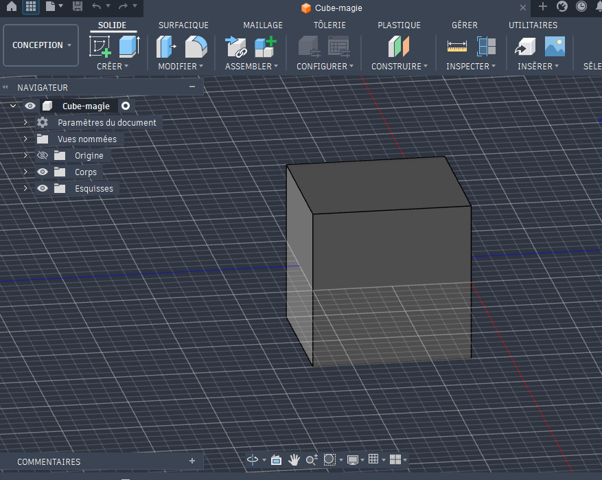
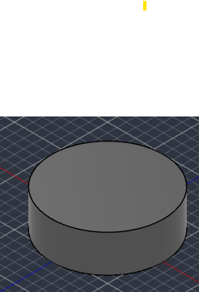
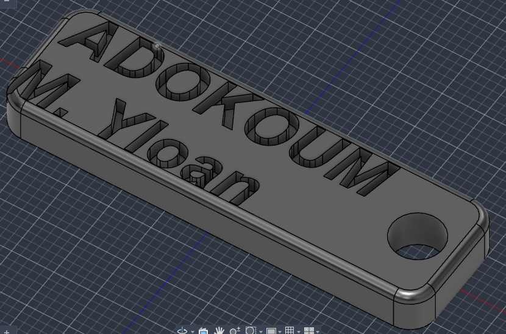
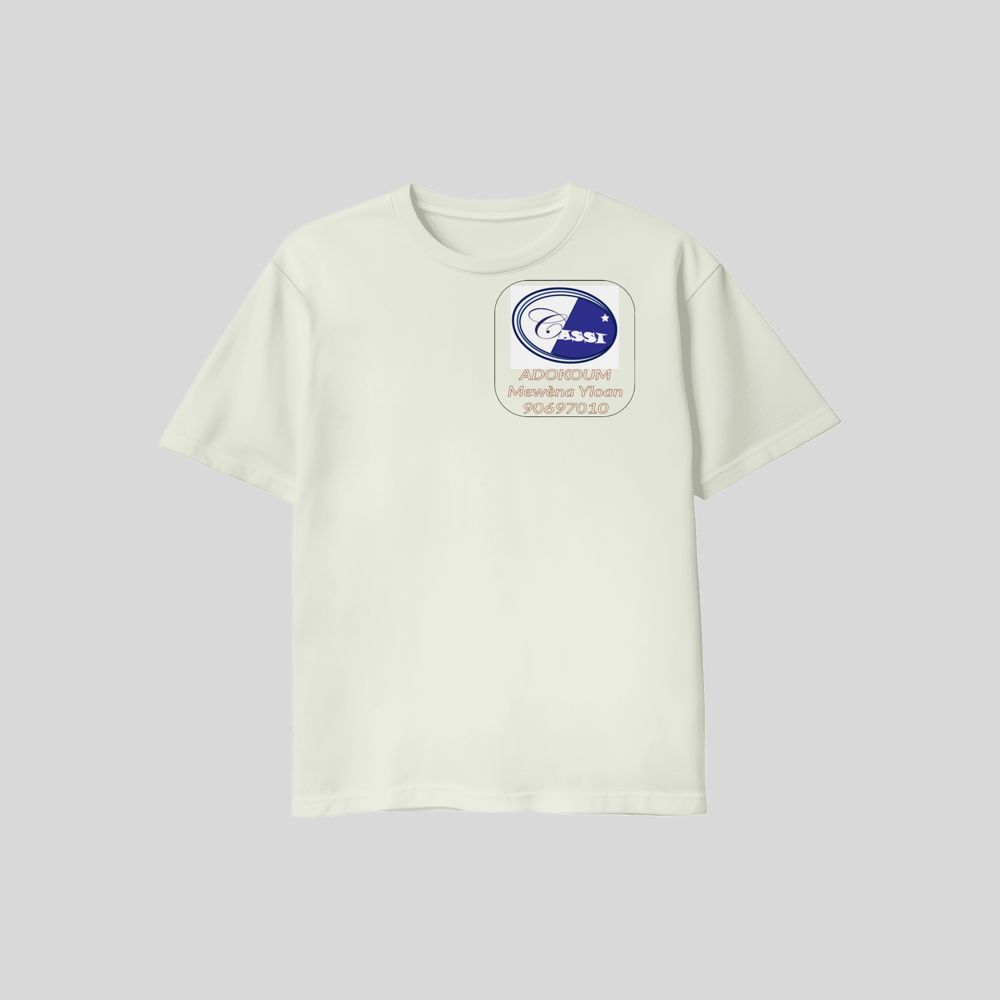

# Journal du 01 septembre 2026 (rédigé par Méyébinesso ADOKOUM)
## Fait aujourd'hui
- Repartition en quatre équipes de 25 personnes
- Contrôle de présence
- Distribution des PC
- Mise en place dans les différents atéliers

>Prémier atélierer: MODELISATION 3D

- Révision sur la création du cube

- Réalisation d'un cylindre en 3D avec les fonctions: 
    - d'Extrusion
    - De Révolution
    - Des outils automatiques de cylindre
- Image du cylindre

   

- Extrusion d'un objet: On peut faire l'extrusion vers:
    - Le haut (Positivement: Joindre ou nouveau corps) ou 
    - Le bas (Négativement: Coupé)

 - Réalisation d'un porte clé

> Les fonction de modifications après Extrusion: La fonction **congé** (Utilisé pour arrondir les bordures. Ceci evite les angles de 90 dégré)
- Convertion de l'objet en composant
- Exporter au format STEP

### NB: Pied à coulisse à payer !!! ###

- Pause d'une heure

>Deuxième atélierer: ELECTRONIQUE

- Prise en main du breadboard
- Explication des connectivité entre le lignes et les colones  sur la plaque d'essai (breaboard)
- Réalisation des circuits sur la plaque d'essai avec: deux(2) LEDs, deux résistances et un transitor
- Exemples de résistor: On positionne la face plate vers nous.
    - Resistor 2N222: Emetteur - Base - Collecteur
    - Resistor BC 337: Collecteur - Base - Emetteur

>Troisième atélierer: IMPRESSION DTF avec xTool

-  Qu'est ce que l'impression DTF
- Matériels nécesssaires
    - Imprimante
    - Film DTF
    - Encres DTF (C, M, J, N + Blanc)
    - Poudre adhésive thermofusible
    - Foure ou Poudrage cuisson
    - Presse à chaud (Applique la chaleur et la pression sur le support)
    - Vetement personnalisé

- Les six étapes du DTF
    1. Concevoir
    2. Imprimer
    3. Poudrer
    4. Cuire
    5. Presser
    6. Retirer

# Appris

- Utilisation du pied à coulisse
- Composants d'une imprimante DTF
## Décidé
- Impression d'un exemplaire
## À faire demain
- [Exercices  sur xTool,  mBloc et BambuLab] — Méyébinesso ADOKOUM