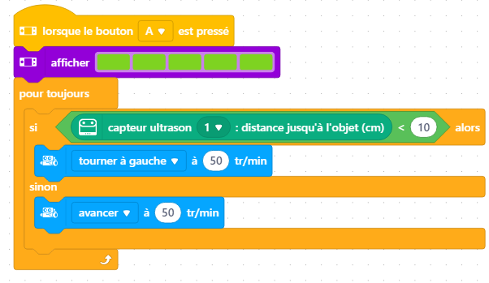

# Journal du 02 septembre 2026 (rédigé par Méyébinesso ADOKOUM)
## Fait aujourd'hui

- Contrôle de présence
- Distribution des PC
- Mise en place dans les différents atéliers

>Prémier atélier: PROJETS

- Modélisation sur papier du prototype du muniteur et sa commande
- Reflexions et recherches divers sur le projet

> Deuxième atélier: ELECTRONIQUE
- Montage du robot mBot2

- Ecriture du code pour faire actionner (avancer, reculer et changer de direction ) le robot

> Troisième Atélier: DECOUPE LAZER - Algorithmique

### Fondamentaux por futurs fabmanage : Algorithmique débranchée

- Qu'est ce qu'un algorithme ?
    C'est une suite d'instruction ordonnée, logique, fini et non ambigue qui permet de résoudre un problème. Un algorithme doit être claire

- Algorithme débranchée
- Trois critères qui définisse un algorithme:
    - Suite d'instruction ordonnée
    - Un nombre fini d'étapes
    - Des instructions précises qui résolvent un problème donné

- Exemple 1: Calibrage d'une imprimante 3D
    1. Mettre l'imprimante sous tension
    2. Chauffer le plateau
    3. Lancer l'autonivellement du plateau
    4. Charger le filament (l'imprimante tire le filament)
    5. Lancer l'impression
- Le filament est placer dans l'AMS

- Exemple 2: Comment charger la bobine de filament
    1. Ouvrir le capot si besoin
    2. Régler la température (parfois avant, parfois après)
    3. Retirer l'ancien filament (ou pas ça dépend)
    4. Pousser le nouveau filament jusqu'à ce que ça sorte

- Exemple 3: Les algorithme ont été toujours utiles
- Historique de l'algorithme
    - Euclide ( -300) -> 
    - Al-Khwârizmî (825: c'est de lui que le nom algorithme est née)
    - Blaise Pascal (1652: Prémière machine à calculer LA PASCALINE)
    - Ada Lovelace (1843: Prémier programme écrit pour une machine)

- Alan Turning: 1936
    - Pause les bases théoriques  du calcul algotithmique
    - Inventer le modèle de la machine universelle

- Margaret Hamilton : 1969
    - Appolo 11
    - Populariser le terme genie Logiciel

- Exercice de calcul mental et comparaison avec le temps de calcul de la machine

- Exercice d'algorithme avec les puces pour la decouverte du tresor

# Appris

- Code et utilisayion des capteurs
- Comment faire le lien entre les enttrées et les sorties (actionneurs)
## Décidé
- Rien
## À faire demain
- [code python à reviser]