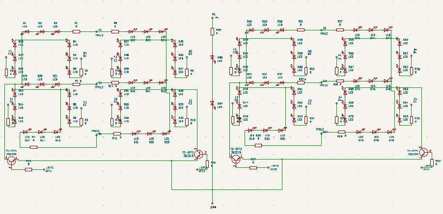

# Journal du 08 septembre 2026 (rédigé par Méyébinesso ADOKOUM)
## Fait aujourd'hui

- Distribution des PC

> ATELIER 1: Projet
- Conception du circuit de l'afficheur (LEDs + RESISTANCES) avec le logiciel KiCad

> ATELIER 2: FABRICATION ASSISTER PAR ORDINATEUR ET USINAGE CNC

- De la conception à la pièce usinée avec Fusion 360
- Objectif: Comprendre la CAM (FAO), le pilotage des machines CNC et le flux de travail dans le module Manifacture Fusion 360
- CAO : Conception Assistée par Ordinateur
- FAO : Fabrication Assistée par Ordinateur
- Qu'est ce que la FAO (CAM)
    - Calcul des trajectoires d'outils precises à partir de la géometrie
    - Simulation d'usinage avant tout
    - Génération d'un code machine: G-Code
    - CAO (dessine la pièce, Modélisation avec Fusion par exemple) --> FAO (Choix des outils) --> CNC (Simulation) -->Pièce Finale
- Les machines CNC (Commande Numérique par Calculateur)
    - Fraisage (Milling): Retir la matière
    - Tournage (Turning): La pièce tourne autour d'un axe
    - Découpe / Routage

- Fusion 360: Un environement unique  pour : Design - Manifacture - Simulation - Drawinng
- Flux de travail FAO dans Fusion
    1. Setup
    2. Choix des outils
    3. Opération d'usinage
    4. Simulation
    5. Post traitement: Génération du G-Code

- LE SETUP: C'est la première étape essentielle
    - Origine
    - Brut (Stock)
    - Orientation
    - Type de machine

- Stratégie d'usinage: Ebauche et Finition
    1. Ebauche (Roughing) 
    2. Finition (Finishing): Contour - Parallel - Scallop
    3. 
- Les paramètres de coupes clés
    - VC: Vitesse de coupe (tr/min)
    - VF: Vitesse d'avance (mm/min)
    - AP: Profondeur de passe
    - AC: Engagement radial

**BN:** Toutes ces valeur dépendent du matériau usiné, de l'outil et de la rigidité de la machine

- SIMULATION: Vérification avant usinage
- POST TRAITEMENT: Géneration du G-Code

- Trajectoire(Fusion360) --> Post processeur (Machine cible) --> G-Code (.nc / .tap) --> Machine CNC
- Pourquoi utiliser la FAO dans Fusion 360?
    - Continuité
    - Gain de temps
    - Sécurité du processus
    - Acessibilité et collaboration
- Bonnes pratiques FAO:
    - Simmuler avant l'usinage
    - Adapter les paramètres au matériau et à l'outil
    - Sécurisé le brut et l'origine pièce
    - Vérifier le post processeur utiliser

> Pratique

- Prémière fonction
- Deuxième fonction: Mêche + Collier (outils à créer)
- Gestion du contour
- PMP = H / NP avec:
     - PMP == Profondeur Maximum de Passe
     - H == Hauteur de la face intérieur
     - NP == Nombre de Passe
- Dernière Opération: CONTOUR 2D
- Simulation
- Importation du fichier GRBL
- Export du G-Code

# Appris

- Decouverte des concepte de CAO, FAO et IAO
## Décidé
- Rien
## À faire demain
- [Exercices  ] — Méyébinesso ADOKOUM