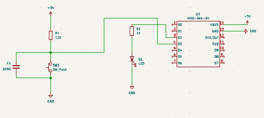
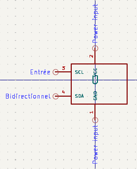
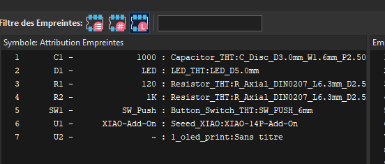
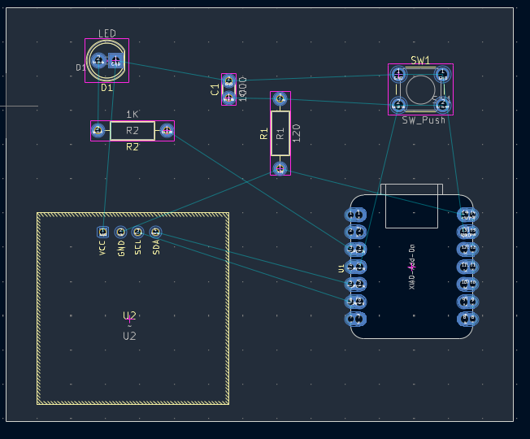

# Journal du 09 septembre 2026 (rédigé par Méyébinesso ADOKOUM)
## Fait aujourd'hui
- Distribution des PC
>  Recherches sur le cicuit de la commande du minuteur  

> Conception shéatique avec KiCad

- Installation de la librairie du XIAO ESP32 S3 pour KiCad 
- Exemple de circuit sur Kicad 

- Création de la librairie pour l'ecran OLED 128x64

- Créeation de nouveau symbole

- Création d'une nouvelle empreinte
- Assignation d'empreinte

- Edition de PCB

> RAPPELS 

- Les variables
- Structures Conditionnelles 
- Les boucles
- Les commentaires
- Les fonctions
- Les opérateurs: 
    - Arithmétiques
    - Logiques
    - Comparaisons
    - Affectations
    - etc ...
- **Informatique**: Science de traitement automatique de l'information par les ordinateurs
    - **Ordinateur:** (Parle le langage machine) Composé de HARDWARE (Péripherique d'entrée + Périphérique de sortie) + SOFTWARE
    - **Logiciel:**  Ensemble d'Applications
    - **Application:** Ensemble de programmes
    - **Programme:** Ensemble d'instructuions
 ## CONVENTIONS
1. La distance de séparation entre les broches des circuits intégrés est de 2,5 mm.
2. Pour perforer un circuit imprimé, le prémier trou est un carré et le reste des trous sont des cercles (de gauche à droite).

# Appris

- Installation de librairie 
- Création d'une librairie pour l'ecran  OLED
- Edition des empreintes des composants
- Création et assignation d'empreinte
- Edition du PCB

## Décidé
- Realiser sur KiCad le circuit du minuteur
## À faire demain
- [TPs] — Méyébinesso ADOKOUM
