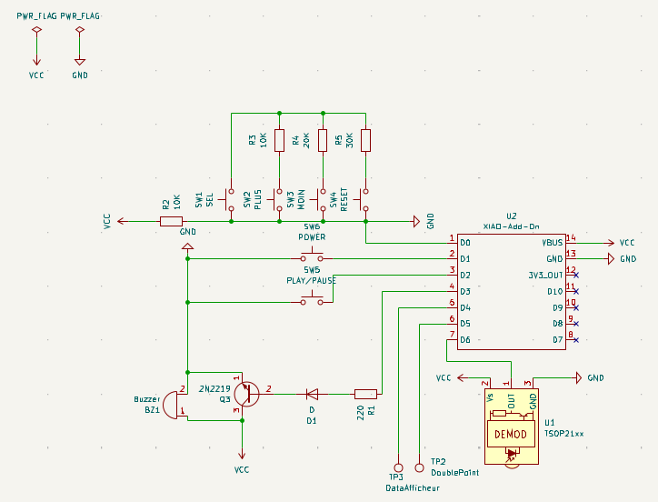
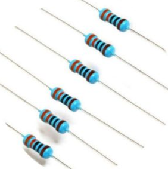
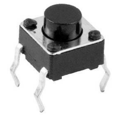
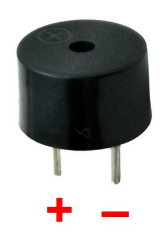
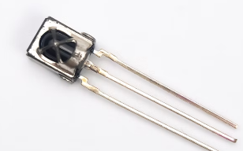
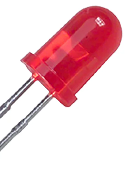
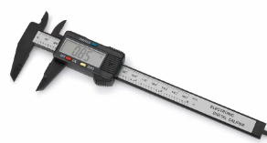

# Journal du 10 septembre 2026 (rédigé par Méyébinesso ADOKOUM)
## Fait aujourd'hui
- Distribution des PC
- Edition du journal
- Edition de PCB
- Travail en groupe sur les projets
- Réception des composants
- Réalisation du circuit pour le projet

- Liste des composants
    - ESP32 S3
    - Multimètre
    - Résistances

    
    
    - Bouton poussoir
    
    
    
    - Buzzer
    
    
    
    - Recepteur Infra Rouge
    
    
    
    - Leds
    
    
    
    - Digital Caliper: Utiliser pour prendre les mesures des composants et outils
    
    

# Appris

- Ajout de nouveaux composants sur KiCad
- Edition des empreintes sur Kicad

## Décidé
- Recherche sur developpement du code python

## À faire demain
- [Devéloppement du code micro python pour le minuteur et edition PCB] — Méyébinesso ADOKOUM
    
