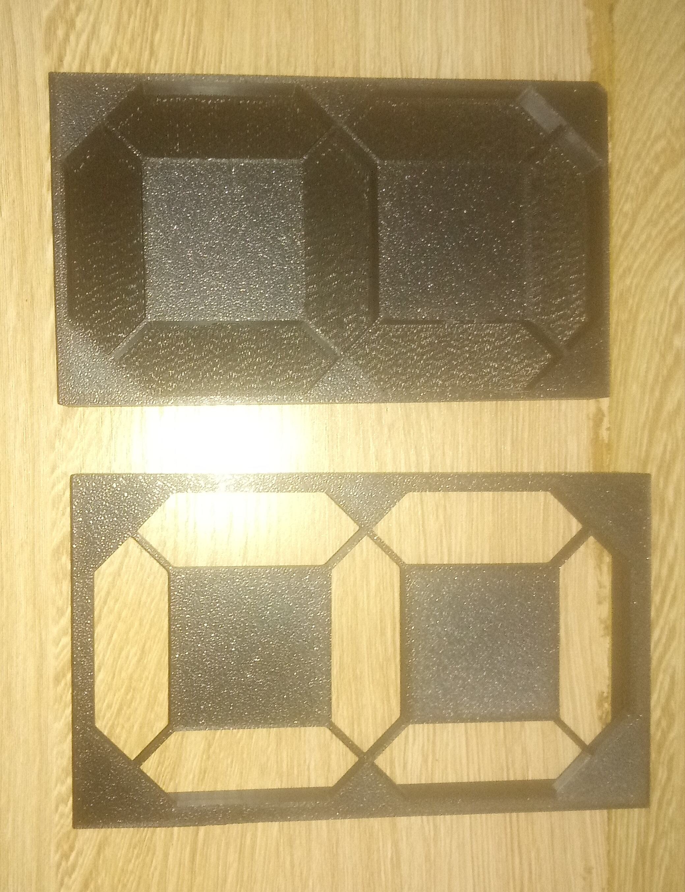

# Journal du 11 septembre 2026 (rédigé par Méyébinesso ADOKOUM)
## Fait aujourd'hui
- Distribution des PC
- Edition du journal
- Slicing et tranchage du boitier 

- Impression prototype du boitier pour supporter les leds de chaque segments
- Modification du circuit du minuteur sur KiCad
- Routage entre les composants par les pistes sur KiCad
- Changement de composants: les résistances
- Devéloppement du code python pour le minuteur

# Appris

- Détails du slicing
- Modification des empreintes sur Kicad
- Choix du filament
- Trancher le plateu
- Exporter les fichiers au format G-Code

## Décidé
- Lancement d'impression
- Developpement du code

## À faire demain
- [Devéloppement du code micro python pour le minuteur] — Méyébinesso ADOKOUM